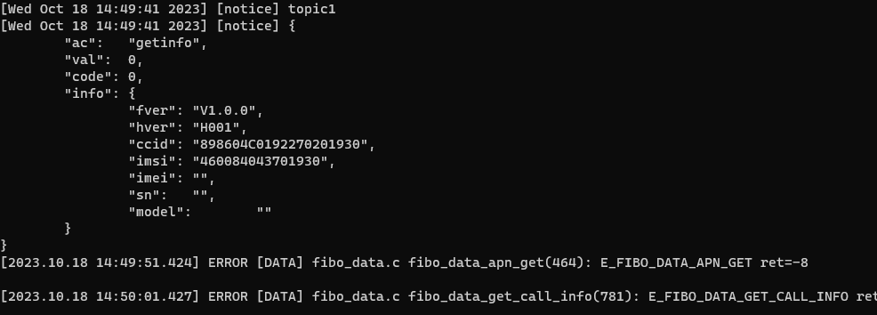
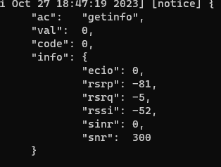
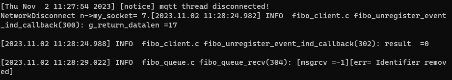
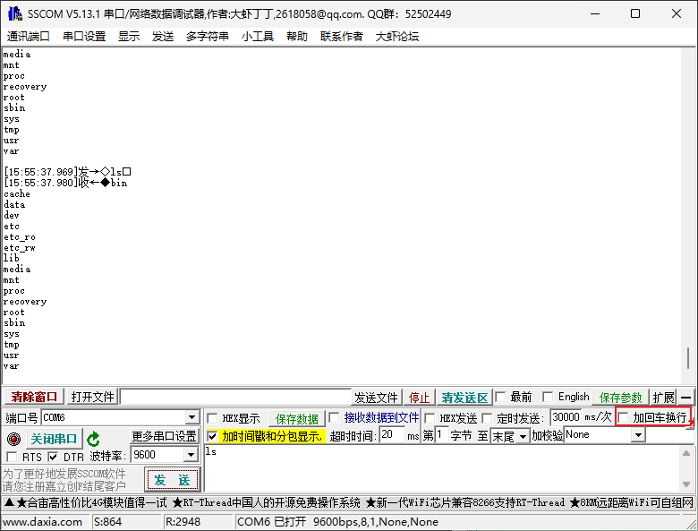
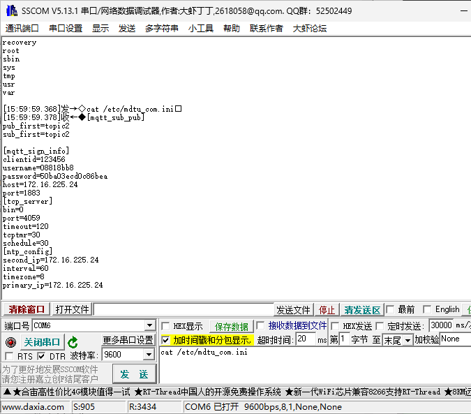
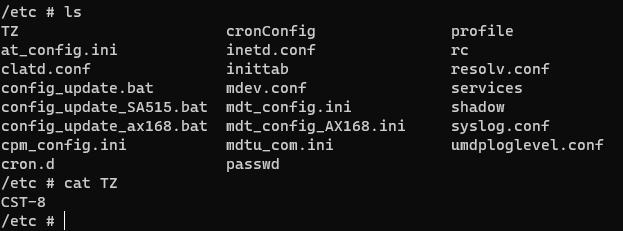
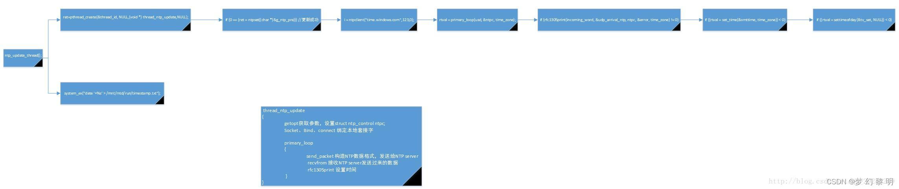
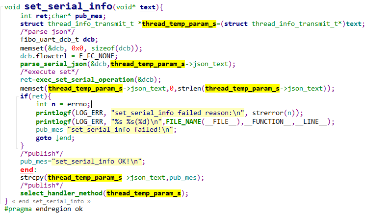
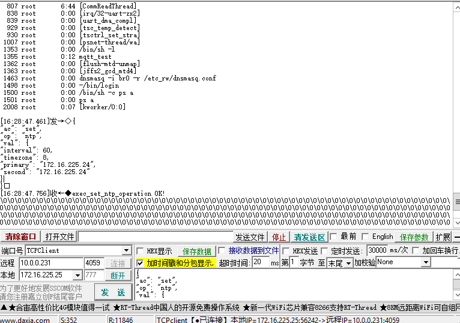
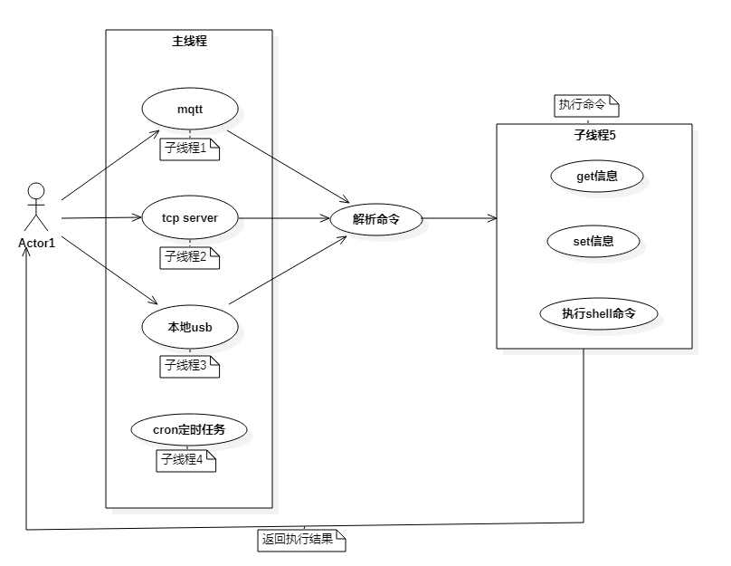

## 1、联网

/*联网前用,执行at命令【AT+MIPCALL=1】,否则会拨号失败*/

将mqtt_test.c文件中的

```C
#define APN_NAME   "3GNET"
#改为
#define APN_NAME   "CMNET"
```

# 2、添加cjson库的报错

[下载地址](https://sourceforge.net/projects/cjson/)

找不到pow和floor函数，[解决方法](https://blog.csdn.net/loushuishizhong/article/details/96483208)。

# 3、创建json对象

```C
create_json_object(){
	cJSON *root,*fmt;char* out;

	root=cJSON_CreateObject();	
	cJSON_AddItemToObject(root, "name", cJSON_CreateString("Jack (\"Bee\") Nimble"));
	cJSON_AddItemToObject(root, "format", fmt=cJSON_CreateObject());
	cJSON_AddStringToObject(fmt,"type",		"rect");
	cJSON_AddNumberToObject(fmt,"width",		1920);
	cJSON_AddNumberToObject(fmt,"height",		1080);
	cJSON_AddFalseToObject (fmt,"interlace");
	cJSON_AddNumberToObject(fmt,"frame rate",	24);
	
	out=cJSON_Print(root);	cJSON_Delete(root);	printf("%s\n",out);	free(out);	/* Print to text, Delete the cJSON, print it, release the string. */
```


# bug

1、主线程中执行发布和订阅失败

解决方法：引入线程池执行发布和订阅，并将耗时任务用线程执行。

mqtt  yield方法保持激活

### 工作进度核对

2023/10/13 已完成的工作，核对已完成工作

1. 逻辑简单介绍，考量可行性
2. 遇到的问题，咨询解决方法

待完成的工作，核对待完成工作思路

1. 代码重构
2. 逻辑优化
3. 冗余代码剥离
4. 功能调整
5. 加本地串口

### 正在进行的工作

**完善task**

1、代码重构mqtt和tcp server getinfo extract，改makefile。[参考](https://gitlab.qiot.cn:8051/embed/simcom/a7608e/es5020)

- 创建目录结构 :ok:
- 修改makefile :ok:
- 代码重构
  - 分析es5020代码逻辑 :ok:
  - 重构自己代码 :ok:

2、网络重连，看门狗实现。回调判断网络是否激活成功；尝试mqtt连接，若连接失败继续休眠。:clock3:...

3、get不到的信息用at命令拿，参考`E:\L716\L716-EU-10\软件\通用\FIBOCOM L716-CN-50 AT Commands_V1.0.0.pdf`:clock4:...//用软件接口试试，at客户端无效:ok:

**功能task**

4、log函数实现  :ok:

**5**、执行shell命令功能，并返回结果。如ls命令 :ok:

7、tcp server 通讯:ok:

11、扩展信息从配置文件中拿:ok:

**12**、get 6.移植ntp:ok:

15、ntp 配置信息从配置文件中拿:ok:

16、配置文件读写实现:ok:


**6**、本地usb接口通讯:ok::two:

19、makefile 将.o文件都放到object目录:ok::two:

25、调整mqtt、usb、tcp server 接口调用逻辑:ok::two:

20、shell和json可在同一端口或者主题直接操作:ok::two:

23、初始化配置文件:ok::two:

27、shell功能完善，支持除cd以外的所有shell命令:ok::two:


26、升级功能实现

1. http下载文件:ok:
2. 更新文件末尾添加crc32:ok:
3. 计算crc32并校验:ok:
4. 替换app:ok:

28、val值不对:ok:

30、更新线程逻辑调整，

**bug**：有时候会重启失败

原因：经测试是sdk问题

**solve**：配合自启脚本使用

- 交互逻辑


31、log修改:ok:

29、联网前执行at命令【AT+MIPCALL=1】、或者为什么要断网？:ok:

22、时区修改:ok:

14、set方法实现:ok:

14.1、get方法完善:ok:

21、集成cron:ok:

22、修改cron超时bug:ok:

**18**、修改系统时区？；调用cron接口每1个小时同步1次；若主服务器地址同步失败，调用次服务器地址同步。:ok:

- 测试 tcpserver功能:ok:
- 测试mqtt


1. 画逻辑图:ok:
1. 测试开机自启:ok:
1. 添加注释:ok:
1. 启动失败自动重启，包括线程。:clock1:

10、修改信号处理函数:ok:

3、解决网络断连和snmp的冲突。

8、统一变量类型 uint/int，方便移植:ok:

13、规范文件名称

##### **现存问题**

1、部分at命令无效，或者找不到对应at命令

2、本地usb通讯硬件接线方法


2023/10/18 **已知bug**

**bug1**

bug出现情况：压力测试下(连续遍历50次getinfo)

bug描述：在第二遍或者第三遍的时候会读取信息失败



**bug2**

退出很慢

bug3  莫名奇妙 10/27

偶尔usb fd打开为很大的整数，无法write 

**bug4**

已解决

val值不对



**bug5**

publish 偶尔出错

**bug6**

有时更新后重启失败



原因未知

解决方法：配合自动启动脚本使用

### 注意

测试命令

```shell
cat /etc/mdtu_com.ini
ls
```


- 发送shell命令的时候注意取消"加回车换行"






## 配置

ntp时区配置文件




ntp流程图



```c
#get
struct thread_temp_param_t *thread_temp_param_s=(struct thread_temp_param_t*)text;
int a=thread_temp_param_s->code;

thread_temp_param_s->json_text=pub_mes;
/*publish*/
select_handler_method(thread_temp_param_s);

#set
char* pub_mes;
struct thread_temp_param_t *thread_temp_param_s=(struct thread_temp_param_t*)text;

parse_serial_json(&dcb,【thread_temp_param_s->json_text】);

cJSON_Delete((cJSON*)thread_temp_param_s->json_text);
thread_temp_param_s->json_text=NULL;

pub_mes="exec_set_operation failed!\n";
free(thread_temp_param_s);
return;

/*publish*/
pub_mes="set_serial_info OK!\n";
thread_temp_param_s->json_text=pub_mes;
select_handler_method((void*)thread_temp_param_s);


goto end;

end:
```

### 



### tcp server测试



### 用例图


