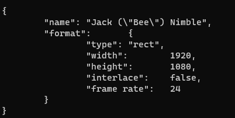

## 1、联网

将mqtt_test.c文件中的

```C
#define APN_NAME   "3GNET"
#改为
#define APN_NAME   "CMNET"
```

# 2、添加cjson库的报错

[下载地址](https://sourceforge.net/projects/cjson/)

找不到pow和floor函数，[解决方法](https://blog.csdn.net/loushuishizhong/article/details/96483208)。

# 3、创建json对象

```C
create_json_object(){
	cJSON *root,*fmt;char* out;

	root=cJSON_CreateObject();	
	cJSON_AddItemToObject(root, "name", cJSON_CreateString("Jack (\"Bee\") Nimble"));
	cJSON_AddItemToObject(root, "format", fmt=cJSON_CreateObject());
	cJSON_AddStringToObject(fmt,"type",		"rect");
	cJSON_AddNumberToObject(fmt,"width",		1920);
	cJSON_AddNumberToObject(fmt,"height",		1080);
	cJSON_AddFalseToObject (fmt,"interlace");
	cJSON_AddNumberToObject(fmt,"frame rate",	24);
	
	out=cJSON_Print(root);	cJSON_Delete(root);	printf("%s\n",out);	free(out);	/* Print to text, Delete the cJSON, print it, release the string. */
```




# bug

1、主线程中执行发布和订阅失败

解决方法：引入线程池执行发布和订阅，并将耗时任务用线程执行。

mqtt  yield方法保持激活

### 工作进度核对

2023/10/13 已完成的工作，核对已完成工作

1. 逻辑简单介绍，考量可行性
2. 遇到的问题，咨询解决方法

待完成的工作，核对待完成工作思路

1. 代码重构
2. 逻辑优化
3. 冗余代码剥离
4. 功能调整
5. 加本地串口

### 正在进行的工作

**完善task**

1、代码重构mqtt和tcp server getinfo extract，改makefile。[参考](https://gitlab.qiot.cn:8051/embed/simcom/a7608e/es5020)

- 创建目录结构
- 修改makefile

2、网络重连，看门狗实现。回调判断网络是否激活成功

3、get不到的信息用at命令拿，参考`E:\L716\L716-EU-10\软件\通用\FIBOCOM L716-CN-50 AT Commands_V1.0.0.pdf`

**功能task**

3、解决网络断连和snmp的冲突

4、log函数实现

5、执行shell命令功能，并返回结果。如ls命令


